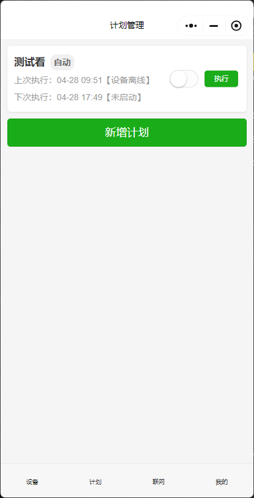
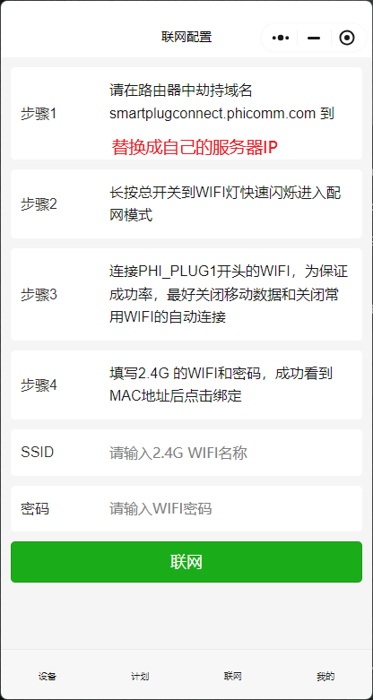

# phicomm_dc1

## 介绍

一个用golang+微信小程序开发的服务，用于控制斐讯 DC1智能插座。
本来是想自己上架个小程序给大家用的，但是微信小程序备案规定，**个人开发者不允许上架设备管理类的小程序**，所以干脆开放出来，给大家自己部署用吧。

## 主要功能

- 支持配网
- 支持开关控制
- 支持联网恢复
- 支持定时任务计划
- 支持设备分享
- 支持mysql/sqlite数据库存储
- 微信小程序支持android、iOS等。

## 部署方式

### 服务端部署

按需修改配置文件，然后执行以下命令进行docker部署

```shell
docker build -t dc1base:latest -f dc1base.Dockerfile .

docker build -t dc1server:latest -f dc1server.Dockerfile .

docker build -t gateway:latest -f gateway.Dockerfile .

docker-compose up -d
```

### 小程序部署

- 先申请小程序 [https://mp.weixin.qq.com/](https://mp.weixin.qq.com/)
- 下载[小程序开发工具](https://developers.weixin.qq.com/miniprogram/dev/devtools/download.html)
- 导入小程序代码，完善appid等信息
  
- 修改服务请求地址phicomm_dc1/miniprogram/utils/config.js
- 上传并设置体验版本

## 软件截图







# DC1消息分析

## udp 消息 网络连接

配网下发

```js
let data = {
    "header": "phi-plug-0001",
    "uuid": "" + port,
    "action": "wifi=",
    "auth": "" + port,
    "params": {
        "ssid": that.data.ssid,
        "password": that.data.password
    }
}
```

DC1回复

```json
{
  "header": "phi-plug-0001",
  "uuid": "00010",
  "status": 200,
  "msg": "set wifi success",
  "result": {
    "mac": "a4:7b:9d:06:a0:e6"
  }
}
``` 

## TCP 消息

### 首次联网后激活（只在配网后发一次）

DC1主动上传

```json
{
  "action": "activate=",
  "uuid": "activate=e28",
  "auth": "",
  "params": {
    "device_type": "PLUG_DC1_7",
    "mac": "A4:7B:9D:06:A0:E6"
  }
}

```

服务端回复
此处 下发的 uid 就是 deviceId

```json
{
  "uuid": "activate=4c3",
  "status": 200,
  "msg": "device activated",
  "result": {
    "uid": "7-7170239623695255",
    "device_type": "plug",
    "last_activated_at": "2023-12-12 23:50:36",
    "name": "PHICOMM_",
    "key": "cwyebqd9"
  }
}

```

### 对时

DC1主动上传

```json 
{
  "action": "datetime",
  "uuid": "datetime8011",
  "auth": "cwyebqd9",
  "params": {}
}
```

服务端回复

```json 
{
  "uuid": "datetime8011",
  "status": 200,
  "result": {
    "datetime": "2023-12-16 00:13:16"
  },
  "msg": "get datetime success"
}
```

### DC1上线

DC1主动上传

```json 
 {
  "action": "identify",
  "uuid": "identify2dab",
  "auth": "cwyebqd9",
  "params": {
    "device_id": "7-7170239623695255"
  }
}
``` 

服务端回复

```json 
{
  "uuid": "12321323",
  "status": 200,
  "msg": "device identified"
}
```

### 功耗统计

DC1主动上传

```json  
{
  "action": "kWh+",
  "uuid": "kWh+bf0ec612",
  "auth": "cwyebqd9",
  "params": {
    "detalKWh": 0
  }
}
```

服务端回复

```json 
{
  "uuid": "",
  "result": {},
  "status": 200,
  "msg": "get datetime success"
}
```

### 开关状态查询

服务端下发

```json
{
  "action": "datapoint",
  "uuid": "1745552755359",
  "auth": "",
  "params": {
    "status": 0
  }
}

```

DC1回复

```json
{
  "uuid": "1745552755359",
  "status": 200,
  "result": {
    "status": 1111,
    "I": 0,
    "V": 235,
    "P": 0
  },
  "msg": "get datapoint success"
}

```

### 主动开关设置

服务端下发

```json
{
  "action": "datapoint=",
  "uuid": "1745560047572161",
  "auth": "",
  "params": {
    "status": 111
  }
}

```

DC1回复

```json
{
  "uuid": "1745552755359",
  "status": 200,
  "result": {
    "status": 1111,
    "I": 0,
    "V": 235,
    "P": 0
  },
  "msg": "get datapoint success"
}

```